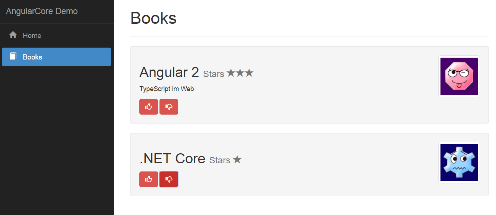
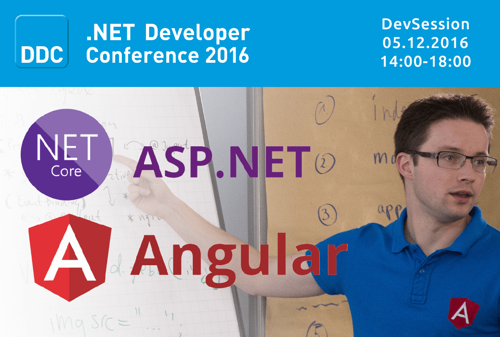

# Demo zu "Dreamteam: ASP.NET Core und Angular 2"




```bash
git clone https://github.com/JohannesHoppe/angularCore.get .
dotnet restore
dotnet run --environment Development
```
<br>

----

# Vortrag "Dreamteam: ASP.NET Core und Angular 2"

[](http://johanneshoppe.github.io/presentations/2016/Angular2_dotnetCore/)


##[» Präsentation Starten](http://johanneshoppe.github.io/presentations/2016/Angular2_dotnetCore/)   


_&copy; 2016, [Johannes Hoppe](http://haushoppe-its.de)_